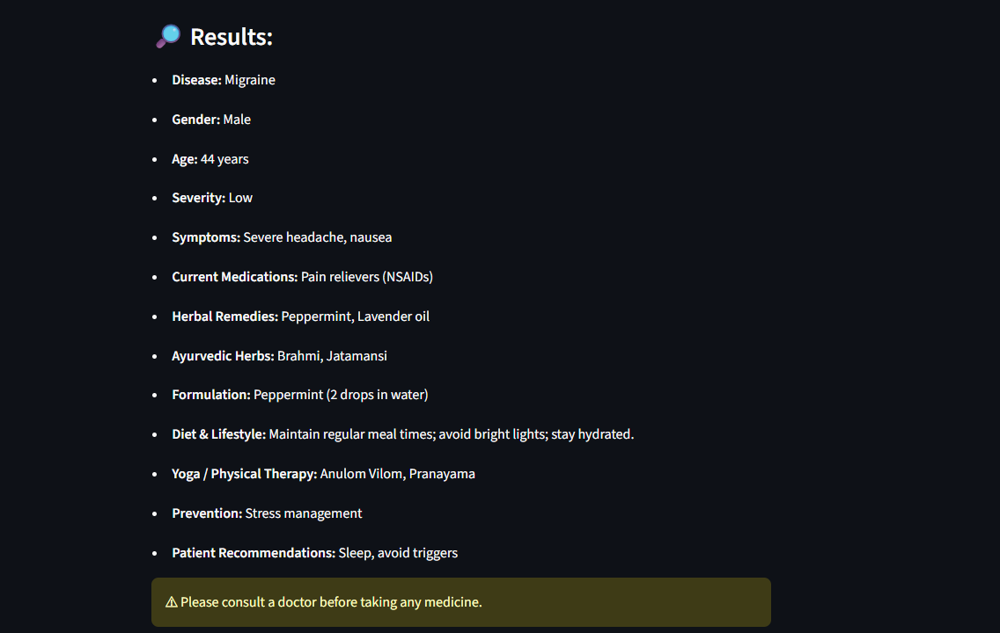

# 🌿 SwasthyaAI – Drug & Disease Consultant Bot  

SwasthyaAI is a **dataset-driven drug and disease consultant bot** that provides health-related insights such as:  
- Disease overview  
- Symptoms and severity  
- Current medications  
- Herbal and Ayurvedic remedies  
- Diet & lifestyle recommendations  
- Yoga & physical therapy guidance  
- Preventive measures and patient tips  

⚠️ **Disclaimer:** This bot is for **educational/demo purposes only**. Always consult a doctor before taking any medication.  

---

## 🚀 Features  

- 🔍 Search by **disease name** or **medicine**  
- 👤 Supports input for **Gender**, **Age**, and **Severity level**  
- 📊 Returns a structured result including:  
  - Disease details  
  - Symptoms  
  - Medications (Allopathic, Herbal, Ayurvedic)  
  - Lifestyle & Yoga recommendations  
  - Prevention strategies  
  - Patient-specific tips  
- 🌙 Dark theme, simple UI for better user experience  

---

## 📷 Demo  

### 🖼 Input Page  
  

### 🖼 Output Page  
  

---

## 🛠️ Tech Stack  

- **Frontend:** React.js (with TailwindCSS / custom styling)  
- **Backend:** Node.js / Express.js *(or dataset-driven JSON lookup)*  
- **Database:** Dataset (CSV/JSON/DB) of diseases & medicines  
- **Deployment:** Localhost / Cloud (Netlify, Vercel, etc.)  

---

## 📂 Project Structure  

```
SwasthyaAI/
│── public/
│── src/
│   ├── components/    # UI Components
│   ├── pages/         # Main screens
│   ├── data/          # Dataset (diseases, medicines, remedies)
│   ├── App.js         # Entry point
│── package.json
│── README.md
```

---

## ⚡ How to Run  

1. Clone the repository  
   ```bash
   git clone https://github.com/your-username/swasthyaAI.git
   cd swasthyaAI
   ```
2. Install dependencies  
   ```bash
   npm install
   ```
3. Run the project  
   ```bash
   npm start
   ```
4. Open in browser:  
   ```
   http://localhost:3000
   ```

---

## 📌 Future Enhancements  

- ✅ Expand dataset with more diseases & medicines  
- ✅ Add AI/ML-based symptom checker  
- ✅ Multi-language support (English + Hindi)  
- ✅ User authentication & medical history tracking  
- ✅ Chatbot-style interactive mode  

---

## 📜 License  

This project is licensed under the **MIT License**.  
Feel free to use, modify, and distribute with proper attribution.  
